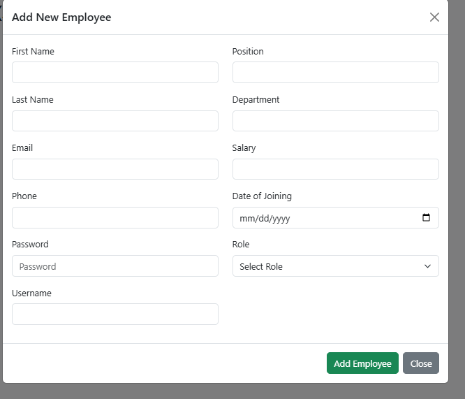

# My name is MUHIRE HILLARY a software engineering student with ID 25291

#  Employee Management System Project overview and Report for final Exam

A dynamic web-based HR management platform that allows HR/Admin to manage employees, assign tasks, mark attendance, generate reports, and more. Built using **HTML**, **CSS**, **PHP**, and **MySQL**.

---

##  Features

- HR/Admin login & registration
- Add, update, and delete employees
- Assign tasks to employees
- Mark attendance
- Send notifications to employees
- Generate & print employee reports
- Employee login and view messages
- Secure and user-friendly UI (3-color design)

---

##  Technologies Used

- HTML
- CSS
- PHP
- MySQL
- VS Code (for development)

---

##  System Screenshots

### 1.  Login Page

This is the login page where HR and Employees enter their credentials.

---

### 2. HR Dashboard

After login, HR sees a dashboard with options to manage the system.

---

### 3. ➕ Add Employee

HR can register a new employee using this form.

---

### 4.  Assign Task

Tasks can be assigned to specific employees.

---

### 5.  Mark Attendance

HR or employee can mark attendance with a timestamp.

---

### 6.  View Messages (Employee)

Employee can login and see messages or tasks sent by admin.

---

### 7.  Generate Reports

HR can generate and print employee and attendance reports.

---

##  Security & Validations

- Strong password and input validation
- Login error messages for invalid credentials
- Password must be at least 10 characters
- Prevents SQL Injection with PHP sanitization

---

##  Objectives Achieved

- Simplified HR tasks using automation
- Enhanced communication through notifications
- Fast and dynamic report generation
- User-friendly and attractive interface

---

##  Innovation Highlights

- Dynamic message and task system
- Attendance recorded with timestamps
- Filter-based report generation

- Secure login and validation system

---

## 📌 Project Setup

1. Clone or download the project
2. Import the SQL file into your MySQL database
3. Configure your database connection in `config.php`
4. Run the project using a local server (e.g., XAMPP or WAMP)
5. Access via `localhost/your-project-folder`

---

## 📞 Contact

For any questions or contributions, feel free to contact me at [muhirehillary720@gmail.com].

